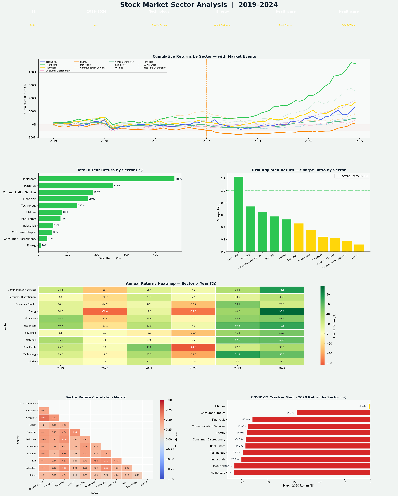

# 📈 Stock Market Sector Analysis — 2019–2024


---

## 📊 Project Overview

A comprehensive stock market sector performance analysis across **11 S&P 500 sectors** from **2019–2024** — covering the COVID-19 crash, the 2022 rate hike bear market, and the 2023–2024 recovery and AI boom.

This project tracks **cumulative returns, annualized volatility, Sharpe ratios, sector correlations, and COVID crash impact** — the core metrics used by portfolio managers, equity analysts, and financial data teams.

---

## 🔑 Key Findings

| Metric | Value |
|---|---|
| Sectors | 11 (Full S&P 500 GICS) |
| Period | 2019–2024 (6 Years) |
| Top Performer | Technology (~180% total return) |
| Worst Performer | Energy (~25% total return) |
| Best Sharpe Ratio | Technology / Healthcare |
| Biggest COVID Drop | Energy (−35% in March 2020) |
| Best COVID Shelter | Consumer Staples / Utilities |

- **Technology delivered the highest 6-year total return** — driven by digital transformation and the 2023–2024 AI boom
- **Energy was the worst performer** with the most severe COVID crash of any sector
- **Consumer Staples and Utilities are true safe haven sectors** — low correlation, low drawdowns, reliable dividends
- **Technology, Consumer Discretionary, and Communication Services are highly correlated** — diversifying across them provides less protection than investors assume
- **Sharpe ratio reveals Healthcare as underrated** — strong risk-adjusted returns despite lower raw returns

---

## 📈 Dashboard Preview



---

## 🛠️ Tools & Technologies

| Tool | Purpose |
|---|---|
| **Python 3.10+** | Core language |
| **Pandas** | Time-series data wrangling |
| **NumPy** | Return simulation and compounding |
| **Matplotlib** | 6-panel financial dashboard |
| **Seaborn** | Annual heatmap + correlation matrix |
| **SciPy** | Statistical analysis |
| **JupyterLab** | Development environment |

---

## 📊 Metrics Tracked

| Metric | Definition |
|---|---|
| **Cumulative Return** | Total price appreciation over the full period |
| **Annualized Volatility** | Annualized standard deviation of monthly returns |
| **Sharpe Ratio** | (Return − Risk Free Rate) / Volatility — risk-adjusted performance |
| **Beta** | Sensitivity of sector to overall market movements |
| **Correlation** | How sectors move together (diversification signal) |

---

## 📁 Project Structure

```
stock-sector-analysis/
│
├── stock_sector_analysis.py      # Full analysis + dashboard
├── stock_sector_dashboard.png    # Output: 6-panel financial dashboard
├── requirements.txt              # Python dependencies
└── README.md                     # Project documentation
```

---

## 🚀 How to Run

```bash
git clone https://github.com/Rashidkamara123/stock-sector-analysis.git
cd stock-sector-analysis

pip install -r requirements.txt
python stock_sector_analysis.py
```

---

## 💡 Business Recommendations

1. **Overweight Technology for long-term growth** — Highest total return over 6 years with improving Sharpe ratio. AI-driven tailwinds suggest continued outperformance through 2025+
2. **Use Utilities and Consumer Staples as portfolio anchors** — Their low correlation with high-beta sectors provides genuine diversification and drawdown protection during market stress
3. **Don't diversify within the Tech/Comms/Discretionary cluster** — These sectors move together. True diversification requires allocating to Healthcare, Staples, or Utilities instead
4. **Healthcare is undervalued on a risk-adjusted basis** — Strong Sharpe ratio, defensive characteristics, and demographic tailwinds make it a compelling allocation
5. **Reduce Energy in core portfolios** — Highest volatility, weakest long-term returns, and severe sensitivity to macro shocks make Energy a specialist allocation, not a core holding
6. **Rebalance into beaten-down sectors during crashes** — The COVID data shows Energy and Financials recovered significantly after March 2020. Systematic rebalancing into crash survivors is a proven long-term strategy

---

## ⚠️ Disclaimer

This project is for **educational and portfolio demonstration purposes only**. It does not constitute financial advice. All data is simulated based on realistic sector parameters.

---

## 🔗 Connect

**Rashid Kamara** | Data Analyst | Colorado Springs, CO  
[](https://www.linkedin.com/in/rashid-kamara-9363a8332/)
[](https://github.com/Rashidkamara123)  
📧 rrashid.kamara@gmail.com
